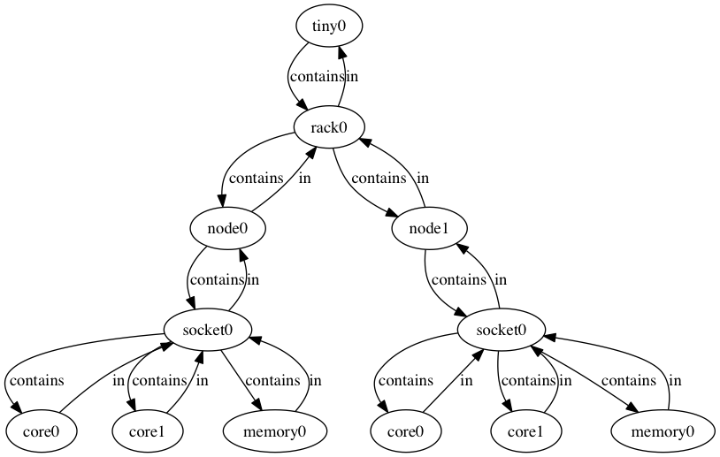

## Resource Query Utility

`resource-query` is a command-line utility that takes in an HPC resource request
written in Flux's Canonical Job Specification (or simply a jobspec)
([RFC 14](https://flux-framework.readthedocs.io/projects/flux-rfc/en/latest/spec_14.html))
and selects the best-matching compute and other resources in accordance with
a selection policy.

The goal of this utility is largely three-fold. First, as we are actively
developing a scalable batch-job scheduling infrastructure within Flux,
`resource-query` provides a way to exercise our infrastructure code so as to
help with our design decisions and development process in general. Second,
this utility is designed to serve as a debugging and testing interface for
our scheduling infrastructure. Finally, `resource-query` aims to facilitate
exascale system-software co-design activities, and it does this by enabling
advanced scheduler developers and policy writers (e.g., IO bandwidth- or
power-aware policies) to test their HPC resource representation and selection
ideas in a much more simplified, easy-to-use environment.

In the following, we describe how `resource-query` builds on our scheduling
infrastructure and how users interact with this utility.

On start-up, `resource-query` reads in a resource-graph generation recipe
written in the GRUG format (see the GRUG section below) and populates
a resource-graph data store, representing HPC resources and their
relationships according to Flux Resource Model
([RFC 4](https://flux-framework.readthedocs.io/projects/flux-rfc/en/latest/spec_4.html)).
Once the graph data store is populated, an interactive command-line
interface (cli) session is started for the user:

```
% resource-query -L conf/default -F pretty_simple --match-subsystems=CA --match-policy=high
% INFO: Loading a matcher: CA
resource-query>
```

The main cli command is `match.` This command takes in a jobspec file name
and either allocates or reserves its best-matching resources. Likewise, this
command provides two subcommands: `allocate` will try to allocate the
best-matching resources for the given jobspec; `allocate_orelse_reserve` will
try to reserve the resources into the future (i.e., earliest possibly
scheduable point), if an allocation cannot be created on the current
resource state.  By contrast, `allocate` will simply not allocate
resources if matching resources are not found in the current resource state.

The following command allocated the best-matching resources for the
specification contained in `test.yaml`:


```
resource-query> match allocate test.yaml
      ---medium-coarse-cluster0[1:shared]
      ------rack3[1:shared]
      ---------node71[1:shared]
      ------------socket1[1:exclusive]
      ---------------memory0[8:exclusive]
      ---------------gpu1[1:exclusive]
      ---------------core15[1:exclusive]
      ---------------core14[1:exclusive]
      ---------------core13[1:exclusive]
      ---------------core12[1:exclusive]
      ---------------core11[1:exclusive]
      ------------socket0[1:exclusive]
      ---------------memory0[8:exclusive]
      ---------------gpu0[1:exclusive]
      ---------------core7[1:exclusive]
      ---------------core6[1:exclusive]
      ---------------core5[1:exclusive]
      ---------------core4[1:exclusive]
      ---------------core3[1:exclusive]
INFO: =============================
INFO: JOBID=1
INFO: RESOURCES=ALLOCATED
INFO: SCHEDULED AT=Now
INFO: =============================
```

The output format of an allocation or reservation is a tree shape
where the root resource vertex appears in the beginning. Each resource is
annotated with the allocated or reserved count and exclusive vs.
shared access modes.

For example, `core15[1:exclusive]` indicates that the 1 unit of `core15` has been
exclusively allocated. Similarly, `memory0[8:exclusive]` shows that the 8 units
(i.e., GB) of `memory1` have been exclusive allocated.

Please note that the granularity of exclusive allocation/reservation is
the whole resource pool vertex, not anything less. Thus, if you want a more
fined-grained exclusive memory allocation, for instance, you should first
model your memory pool vertices with smaller memory unit (e.g., 256MB).

By contrast, the following command reserved the best-matching resources
for `test.yaml`. Notice the output difference: `SCHEDULED AT=Now`
vs. `SCHEDULED AT=3600`

```
resource-query> match allocate_orelse_reserve test.yaml
      ---medium-coarse-cluster0[1:shared]
      ------rack3[1:shared]
      ---------node71[1:shared]
      ------------socket1[1:exclusive]
      ---------------memory0[8:exclusive]
      ---------------gpu1[1:exclusive]
      ---------------core15[1:exclusive]
      ---------------core14[1:exclusive]
      ---------------core13[1:exclusive]
      ---------------core12[1:exclusive]
      ---------------core11[1:exclusive]
      ------------socket0[1:exclusive]
      ---------------memory0[8:exclusive]
      ---------------gpu0[1:exclusive]
      ---------------core7[1:exclusive]
      ---------------core6[1:exclusive]
      ---------------core5[1:exclusive]
      ---------------core4[1:exclusive]
      ---------------core3[1:exclusive]
INFO: =============================
INFO: JOBID=73
INFO: RESOURCES=RESERVED
INFO: SCHEDULED AT=3600
INFO: =============================
```

`test.yaml` used in the above examples are the following:

```yaml
version: 9999
resources:
  - type: node
    count: 1
    with:
      - type: slot
        count: 1
        label: default
        with:
          - type: socket
            count: 2
            with:
              - type: core
                count: 5
              - type: gpu
                count: 1
              - type: memory
                count: 6

attributes:
  system:
    duration: 3600
tasks:
  - command: [ "app" ]
    slot: default
    count:
      per_slot: 1
```

Internally, here is how `resource-query` uses our scheduling infrastructure
for matching. Upon receiving a `match` command, it creates a Jobspec object
and simply passes it into a traversal interface of our infrastructure
to traverse in a predefined order the resource graph
data store previously populated in accordance with a GRUG file.

While traversing, the traverser calls back a callback method of the selected
matcher plugin on certain graph visit events. The matcher callback plugin
represents a resource selection policy. It evaluates the visiting resource
vertex and passes its score to the infrastructure, which then later uses
this score information to determine the best-matching resources to select.

Currently, `resource-query` supports only one traversal type as our scheduling
infrastructure implements only one type: depth-first traversal on the dominant
subsystem and up traversal on one or more auxiliary subsystems.
The traversal capabilities will be expanded as more advanced types will be
designed and developed.  

The resource graph data are managed and organized around the concept
of subsystems (e.g., hardware containment subsystem, power subsystem, network
subsystem, etc). A subsystem is a subset of resource vertices and edges
within the graph data, which forms certain relationships.
A matcher subscribes to one of more these named subsystems as its dominant
and/or auxiliary ones on which matches are performed.

While testing has mostly been done on the hardware containment subsystem
to meet our shorter-term milestones, `resource-query` do offer options for
choosing a predefined matcher that is configured to use different
combinations of subsystems.
Further, `resource-query` provides an option for using different
resource-matching selection policies--e.g., select resources with high or low
IDs first. For more information about its options, please type in
`resource-query --help`. In addition, `resource-query> help` will print out
a message that explains its various cli commands.

## Generating Resources Using GraphML (GRUG)

GRUG is a GraphML-based language for specifying a resource-graph generation
recipe.  `resource-query` can read in a GRUG file and populate its store
of the resource graph data conforming to Flux's resource model
([RFC4](https://github.com/flux-framework/rfc/blob/master/spec_4.adoc)).

The goal of GRUG is to help Flux scheduler plug-in developers easily determine
the representation of this resource graph data (e.g., granularity of resource
pools, relationships between resources, and subsystems/hierarchies to use to
organize the resources) that are best suited for their scheduling objectives
and algorithms. Without having to modify the source code of `resource-query`
and our scheduling infrastructure, developers can rapidly build and test
various resource-graph representations by writing or modifying GRUG text files.

GraphML is an easy-to-use, XML-based graph specification language. GRUG uses
the [vanilla GraphML schema](http://graphml.graphdrawing.org) with no extension,
and thereby familiarity with GraphML is the only prerequisite for fluent uses
of GRUG. We find that the following on-line GraphML materials are particularly
useful:

- [The GraphML File Format](http://graphml.graphdrawing.org)
- [GraphML Primer](http://graphml.graphdrawing.org/primer/graphml-primer.html)
- [Graph Markup Language](https://cs.brown.edu/~rt/gdhandbook/chapters/graphml.pdf)

### GRUG 

GRUG describes a resource-generation recipe as a graph. A vertex prescribes
how the corresponding resource pool (or simply resource as a shorthand) should
be generated;
an edge prescribes how the corresponding relationships between two resources
should be generated. The edge properties also allow a small recipe graph
to generate a large and more complex resource graph store.

A multiplicative edge has a scaling factor that will generate the specified
number of copies of the resources of the target resource type of the edge.
An associative edge allows a source resource vertex to be associated with some
of the already generated resources in a specific manner.

The scheduling infrastructure walks this recipe graph in
the depth-first manner and emits/stores the corresponding resources and their
relationship data into its resource graph store.  
The recipe graph must be a forest of trees whereby each tree represents
a distinct resource subsystem or hierarchy. The terms, hierarchy
and subsystem, are often used interchangeably.

A conforming GRUG file is composed of two sections: 1) recipe graph
definition and 2) recipe attributes declaration. We explain both
in the following subsections.

### Recipe Graph Definition

A recipe graph definition is expressed as GraphML's `graph` elements
consisting of two nested elements: `node` and `edge`. A `node` element
prescribes ways to generate a resource pool and an edge
for generating relationships
([RFC 4](https://github.com/flux-framework/rfc/blob/master/spec_4.adoc)).

For example, in the following definition,

```xml
<node id="socket">
     <data key="type">socket</data>
     <data key="basename">socket</data>
     <data key="size">1</data>
     <data key="subsystem">containment</data>
</node>

<node id="core">
    <data key="type">core</data>
    <data key="basename">core</data>
    <data key="size">1</data>
    <data key="subsystem">containment</data>
</node>
```
the `node` elements are the generation recipes for a socket and
compute-core resource (i.e., scalar), respectively. And they belong to the
containment subsystem.


```xml
<edge id="socket2core" source="socket" target="core">
    <data key="e_subsystem">containment</data>
    <data key="relation">contains</data>
    <data key="rrelation">in</data>
    <data key="gen_method">MULTIPLY</data>
    <data key="multi_scale">2</data>
</edge>
```

Here, this `edge` element is the generation recipe for the relationship between
the socket and core resources.  It specifies that for each socket resource,
2 new `core` type resources (i.e., MULTIPLY and 2) will be generated, and the
relationship type is `contains` and the reverse relationship is `in`.

A resource in one subsystem (e.g., power subsystem) can be associated with
another subsystem (e.g., containment subsystem), and associative edges are
used for this purpose.

```xml
<node id="pdu_power">
    <data key="type">pdu</data>
    <data key="basename">pdu</data>
    <data key="subsystem">power</data>
</node>

<edge id="powerpanel2pdu" source="powerpanel" target="pdu_power">
    <data key="e_subsystem">power</data>
    <data key="relation">supplies_to</data>
    <data key="rrelation">draws_from</data>
    <data key="gen_method">ASSOCIATE_IN</data>
    <data key="as_tgt_subsystem">containment</data>
</edge>
```

Here, this `edge` element is the generation recipe for the relationship between
`powerpanel` and `pdu` resource. It specifies that a `powerpanel` resource will
be associated (i.e., `ASSOCIATE_IN`) with all of the `pdu` resources that have
already generated within the `containment` subsystem. 
The forward relationship is annotated as `supplies_to` and the reverse
relationship as `draws_from`.

Oftentimes, association with all resources of a type is not sufficient to make
a fine-grained association. For the case where the hierarchical paths of 
associating resources can be used to make associations, `ASSOCIATE_BY_PATH_IN`
generation method can be used.

```xml
<edge id="pdu2node" source="pdu_power" target="node_power">
    <data key="e_subsystem">power</data>
    <data key="relation">supplies_to</data>
    <data key="rrelation">draws_from</data>
    <data key="gen_method">ASSOCIATE_BY_PATH_IN</data>
    <data key="as_tgt_uplvl">1</data>
    <data key="as_src_uplvl">1</data>
</edge>
```

Here, the method is similar to the previous one except that the association is
only made with the `node` resources whose hierarchical path at its parent level
(i.e., `as_tgt_uplvl`=1) is matched with the hierarchical path of the source
resource (also at the parent level, `as_src_uplvl`=1).

### Recipe Attributes Declaration 

This section appears right after the GraphML header and before the recipe
graph definition section. To be a valid GRUG, this section must declare all
attributes for both `node` and `edge` elements. Currently, there are 16
attributes that must be declared. 5 for the `node` element and 11 for the `edge`
elements. You are encouraged to define the default value for each attribute,
which then can lead to more concise recipe definitions. A graph element will
inherit the default attribute values unless it specifically overrides them.
The 16 attributes are listed in the following:

```xml
<-- attributes for the recipe node elements -->
<key id="root" for="node" attr.name="root" attr.type="int">
<key id="type" for="node" attr.name="type" attr.type="string"/>
<key id="basename" for="node" attr.name="basename" attr.type="string"/>
<key id="size" for="node" attr.name="size" attr.type="long"/>
<key id="subsystem" for="node" attr.name="subsystem" attr.type="string"/>

<-- attributes for the recipe edge elements -->
<key id="e_subsystem" for="edge" attr.name="e_subsystem" attr.type="string"/>
<key id="relation" for="edge" attr.name="relation" attr.type="string"/>
<key id="rrelation" for="edge" attr.name="rrelation" attr.type="string"/>
<key id="id_scope" for="edge" attr.name="id_scope" attr.type="int"/>
<key id="id_start" for="edge" attr.name="id_start" attr.type="int"/>
<key id="id_stride" for="edge" attr.name="id_stride" attr.type="int"/>
<key id="gen_method" for="edge" attr.name="gen_method" attr.type="string"/>
<key id="multi_scale" for="edge" attr.name="multi_scale" attr.type="int"/>
<key id="as_tgt_subsystem" for="edge" attr.name="as_tgt_subsystem" attr.type="string">
<key id="as_tgt_uplvl" for="edge" attr.name="as_tgt_uplvl" attr.type="int"/>
<key id="as_src_uplvl" for="edge" attr.name="as_src_uplvl" attr.type="int"/>
```

The `root` attribute specifies if a resource is the root of a subsystem.
If root, 1 must be assigned.

`id_scope`, `id_start` and `id_stride` specify how the id field of a
resource will be generated. The integer specified with `id_scope` defines the
scope in which the resource id should be generated. The scope is local to its
ancestor level defined by `id_scope`.  If `id_scope` is higher than the most
distant ancestor, then the id space becomes global. 

For example,
if `id_scope`=0, the id of the generating resource will be local to its parent.
If `id_scope`=1, the id becomes local to its grand parent. For example,
in `rack[1]->node[18]->socket[2]->core[8]` configuration, if `id_scope` is 1,
the id space of a `core` resource is local to the `node` level instead of the
socket level.

So, 16 cores in each node will have 0-15, instead of repeating 0-7 and 0-7,
which will be the case if the `id_scope` is 0.


### Example GRUG Files
Example GRUG files can be found in `conf/` directory.
`medium-1subsystem-coarse.graphml` shows how one can model
a resource graph in a coarse manner with no additional subsystem-based
organization. `mini-5subsystems-fine.graphml` shows one way to model
a fairly complex resource graph with five distinct subsystems
to support the matchers of various types.

 
### GRUG Visualizer
`grug2dot` utility can be used to generate a GraphViz dot file
rendering the recipe graph. The dot file can be converted
into svg format by typing in `dot -Tsvg output.dot -o output.svg`:

```
Usage: grug2dot <genspec>.graphml
    Convert a GRUG resource-graph generator spec (<genspec>.graphml)
    to AT&T GraphViz format (<genspec>.dot). The output
    file only contains the basic information unless --more is given.

    OPTIONS:
    -h, --help
            Display this usage information

    -m, --more
            More information in the output file

```

## Resource Selection Policy
Scheduler resource selection policy implementers can effect their policies
by deriving from our base match callback class (`dfu_match_cb_t`) and
overriding one or more of its virtual methods. The DFU traverser's
`run ()` method calls back these methods on well-defined graph vertex visit
events and uses both match and score information to determine best matching.

Currently, the supported visit events are:

- preorder, postorder, slot, and finish graph events on the selected dominant
subsystem;
- preorder and postorder events on one or more selected auxiliary subsystems.

`dfu_match_id_based.hpp` shows three demo match callback implementations.
They only override `dom_finish_vtx ()`, `dom_finish_graph ()` and
`dom_finish_slot ()` to effect their selection policies, as
they just use one dominant subsystem: `containment`.

For example, the policy implemented in `high_first_t` provides
preference towards higher IDs for resource selection; for example, if node0 and
node1 are both available and the user wanted only 1 node, it will select node1.

The following is the source listing for its `dom_finish_vtx ()`. It is invoked
when all of the subtree walk (on the selected dominant subsystem) and up walk
(on the selected auxiliary subsystems) from the visiting vertex have been completed
and there are enough resource units to satisfy the job specification (i.e.,
method argument `resources`).

```c++
 84     int dom_finish_vtx (vtx_t u, subsystem_t subsystem,
 85                         const std::vector<Flux::Jobspec::Resource> &resources,
 86                         const resource_graph_t &g, scoring_api_t &dfu)
 87     {
 88         int64_t score = MATCH_MET;
 89         int64_t overall;
 90
 91         for (auto &resource : resources) {
 92             if (resource.type != g[u].type)
 93                 continue;
 94
 95             // jobspec resource type matches with the visiting vertex
 96             for (auto &c_resource : resource.with) {
 97                 // test children resource count requirements
 98                 const std::string &c_type = c_resource.type;
 99                 unsigned int qc = dfu.qualified_count (subsystem, c_type);
100                 unsigned int count = select_count (c_resource, qc);
101                 if (count == 0) {
102                     score = MATCH_UNMET;
103                     break;
104                 }
105                 dfu.choose_accum_best_k (subsystem, c_resource.type, count);
106             }
107         }
108
109         // high id first policy (just a demo policy)
110         overall = (score == MATCH_MET)? (score + g[u].id + 1) : score;
111         dfu.set_overall_score (overall);
112         decr ();
113         return (score == MATCH_MET)? 0 : -1;
114     }
```

The scoring API object, `dfu`, contains relevant resource information gathered
as part of the subtree and up walks.

For example, you are visiting a `socket` vertex and `dfu` contains a map of
all of the resources that are at its subtree, which may be 18 compute cores
and 4 units of 16GB.
Further, if the resource request was `slot[1]->socket[2]->core[4]`, 
the passed `resources` at the `socket` vertex visit level would be `core[4]`.

The method then checks the count satifiability of the visiting `socket`'s
child resource and then calls `choose_accum_best_k ()` within `dfu` scoring
API object to choose the best matching 4 cores among however many cores
available. (line #105).

`choose_accum_best_k ()` uses the scores that have already been calculated
during the subtree walk at the core resource level. Because the default
comparator of this method is `fold::greater`, it sorts the cores in
descending ID order. This way, the cores with higher IDs get selected first.

If the visiting vertex satisfies the request, it sets the score
of the visiting vertex using `set_overall_score ()` method at line #111.
In this case, the score is merely the ID number of the visiting vertex.  

Similarly, `dom_finish_graph ()` performs the same logic
as `dom_finish_vertex ()` but this has been introduced so that
we can perform a selection for the first level resource request when
the entire graph has completed (e.g., `cluster[1]`) without having to
introduce special casing within `dom_finish_vtx ()`.

Finally, `dom_finish_slot ()` is introduced so that the match callback can
provide score information on the discovered slots using its comparator.

Note that, though, there is no real `slot` resource vertex in the
resource graph, so you cannot get a postorder visit event per each
slot. Instead, the DFU traverser by itself will perform the satisfiability
check on the child resource shape of each slot. But this matcher
callback method still provides the match callback class with an
opportunity to score all of the the child resources of the discovered
`slot`.

The examples in `dfu_match_id_based.hpp` uses `choose_accum_all ()`
method within the scoring API object to sort all of the child resources
of `slot` according to the selection policies.

The Scoring API classes and implementation are entirely located in
`scoring_api.hpp`.

## Fully vs. Paritially Specified Resource Request

The resource section of a job specification can be fully or partially
hierarchically specified. A fully specified request describes the resource
shape fully from the root to the requested resources with respect
to the resource graph data used by `resource-query`. A partially specified
resource request omits the prefix (i.e., from the root to the highest-level
resources in the request). For example, if the resource
graph data used by `resource-query` is the following,



then, the next fully hierarchically specifies the resource request:

```yaml
version: 9999
resources:
    - type: cluster
      count: 1
      with:
        - type: rack
          count: 1
          with:
            - type: node
              count: 1
              with:
                  - type: slot
                    count: 1
                    label: default
                    with:
                      - type: socket
                        count: 1
                        with:
                          - type: core
                            count: 1

```

By contrast, the following partially hierarchically specifies the resource
shape, as it omits from the `cluster` and `rack` levels.

```yaml
version: 9999
resources:
  - type: node
    count: 1
    with:
        - type: slot
          count: 1
          label: default
          with:
            - type: socket
              count: 1
              with:
                - type: core
                  count: 1

```

Because the latter does not impose higher-level (i.e., `cluster` and
`rack` levels) constraints, `node` type resources will be evaluated by the match
callbacks and all of them will be compared at once to select the highest scored
node.  On the other hand, with the higher-level constraints of the former
specification, `resource-query` will choose the highest-scored node at the
`rack` level in the same manner as how it enforces the lower-level constraints
(e.g., `socket`).


## Limitations of Depth-First and Up (DFU) Traversal

You can implement a wide range of resource selection policy classes using the
DFU traversal, in particular in combination with other mechanisms (e.g., choosing
a different set and order of subsystems).  DFU, however, is a simple, one-pass
traversal type and hence there are inherent limitations associated with DFU,
which may preclude you from implementing certain policies.

For example, DFU cannot currently handle the following job specification even
if the underlying resource graph store has a rack that contains those compute
nodes that can satisfy either type of node requirements: one with more cores
and burst buffers (bb) and the other fewer cores with no advanced features.

```yaml
version: 9999
resources:
  - type: cluster
    count: 1
    with:
      - type: rack
        count: 1
        with:
          - type: slot
            count: 2
            label: gpunode
            with:
              - type: node
                count: 1
                with:
                  - type: socket
                    count: 2
                    with:
                      - type: core
                        count: 18
                      - type: gpu
                        count: 1
                      - type: memory
                        count: 32
                  - type: bb
                    count: 768

              - type: node
                count: 1
                with:
                  - type: slot
                    count: 2
                    label: bicore
                    with:
                      - type: socket
                        count: 1
                        with:
                          - type: core
                            count: 2
```

In general, to be able to handle a jobspec where resource requests
of a same type appears at the same hierarchical level (in this case compute
`node` type under the `rack` level), the traverser must be able to perform
a subtree walk for each of them to evaluate a match.  However, DFU does not
have an ability to repeat certain subtree walks and thus it cannot handle
this matching problem.

Note that DFU can solve similar but slightly different matching problem:
different `node` types are contained within differently named `rack` types.
For example, the following jobspec can be matched if the
underlying resource model labels the type of the rack with the beefy compute
nodes as `rack` and the other as `birack`.

```yaml
version: 9999
resources:
  - type: cluster
    count: 1
    with:
      - type: rack
        count: 1
        with:
          - type: slot
            count: 2
            label: gpunode
            with:
              - type: node
                count: 1
                with:
                  - type: socket
                    count: 2
                    with:
                      - type: core
                        count: 18
                      - type: gpu
                        count: 1
                      - type: memory
                        count: 32
                  - type: bb
                    count: 768

      - type: birack
        count: 1
        with:
          - type: slot
            count: 2
            label: bicorenode
            with:
              - type: node
                count: 1
                with:
                  - type: socket
                    count: 2
                    with:
                      - type: core
                        count: 2
```

When more advanced classes of resource selection policies are required,
you need to introduce new traversal types. For example, an ability
to traverse a subtree more than once for depth-first walk--e.g., Loop-aware
DFU--can solve the examples shown above.
We designed our scheduling infrastructure to be extendable, and a part
of our future plan is to extend our infrastructure with more capable
traversal types.

If you are interested in our earlier discussions on the different classes
of matching problems, please refer to
[this issue](https://github.com/flux-framework/flux-sched/issues/247#issuecomment-310551638)

